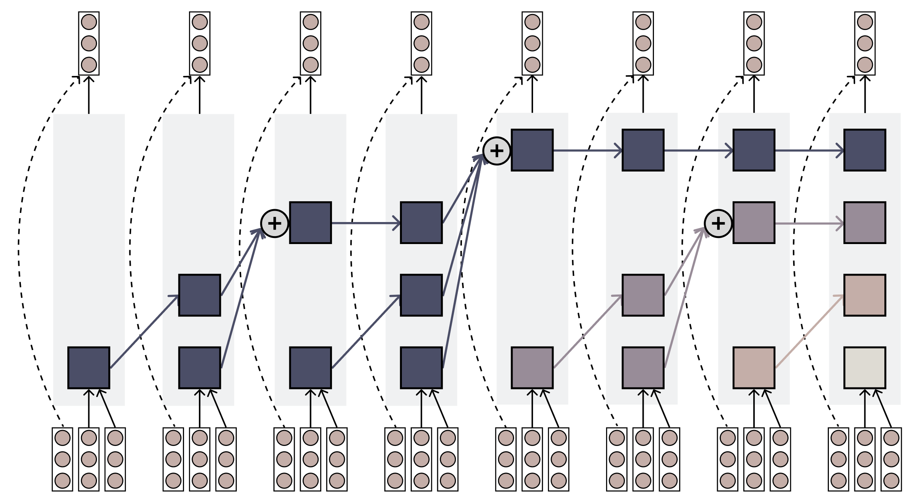

# Log Linear Attention



## Setup

1. Clone the repository and its submodules:
```bash
git clone --recursive https://github.com/HanGuo97/log-linear-attention.git
cd log-linear-attention
```

2. Install the package and its dependencies:
```bash
pip install -e .
pip install -e flame/
pip install -r flame/3rdparty/torchtitan/requirements.txt
```

## Data Preparation

To configure the data preprocessing, open `hattention/preprocess_data.py` and modify the save path to your desired location. Then run the preprocessing script:
```bash
python -m hattentions.preprocess_data
```

> [!NOTE]
> The data preprocessing step may take a while.

## Train

First, step into the training framework `flame/`
```bash
cd flame/
```

Then launch training!
```bash
bash ../scripts/train_flame.sh --name [NAME] --config [CONFIG] --seed [--ac]
```

- `NAME`: Name for the experiment and save path
- `CONFIG`: Name of the config file in `configs/flame/` (without .json extension)
- `--seed`: creating a seed checkpoint before training
- `--ac`: Optional flag to enable activation checkpointing

> [!NOTE]
> 1. Modify the absolute file paths in `scripts/train_flame.sh` to match your setup
> 2. The first training step will compile Triton kernels, which may take tens of minutes
